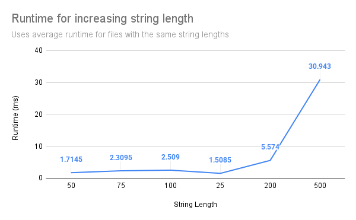

# Programming Assignment 3: Highest Value Longest Common Sequence

#### Will Berg: 39326193
#### Lam Nguyen: 88729415

Instructions: clone repo into an empty working directory, run main.py and enter the name of a data file without extensions
```
cd src
python main.py
Input file name without extension: test
```
Assume that all input files are in the correct format. A randomly generated input file can be created by running input-generator.py and following the instructions.

### Question 1: Empirical Comparison

Files can be found in the data folder labeled 1 to 12. 


All files have k = 26.

| File | Length | Runtime (ms) |
|------|--------|--------------|
| 1    | 25     | 1.655        |
| 2    | 30     | 1.39         |
| 3    | 40     | 1.683        |
| 4    | 50     | 1.509        |
| 5    | 75     | 2.224        |
| 6    | 100    | 2.48         |
| 7    | 150    | 3.888        |
| 8    | 200    | 5.827        |
| 9    | 250    | 8.217        |
| 10   | 300    | 11.135       |
| 11   | 400    | 19.945       |
| 12   | 500    | 30.729       |


### Question 2: Recurrence Equation

$$
OPT(i, j) = \begin{cases}
0 & i = 0 & or & j = 0\\
v(A_i) + OPT(i-1,j-1) & A_i = B_j\\
max(OPT(i-1,j),OPT(i,j-1)) & otherwise\\
\end{cases}
$$

The indices i and j represent the last characters of the current strings being compared. When the current index in either string is 0, there are no characters from that string to select from. As such, there is no subsequence that can be formed from that string, and there thus cannot be a common subsequence made between the two strings. This gives base cases of a value of zero for $i = 0$ or $j = 0$.

It is given that character values are nonnegative. Assuming any other subsequence that can be selected, it will always be possible to add the last character of a string without restricting access to another character and decreasing the subsequence's total value. As long as the character's value is greater than zero, the subsequence with the last character added will have a higher total value than any subsequence without it. So, the algorithm selects the last character from the two strings whenever they are a match. After selecting the last character from both strings, neither string can use that character anymore. So, the value of that character is added to the maximum subsequence value using both strings without their final character. This gives the case of $v(A_i) + OPT(i-1,j-1)$ for $A_i = B_j$.

When the last characters of the strings are not the same, then at least one of the two characters will not be used in the common subsequence. In the case that one of the two last characters is used, it will match with a character from the other string that comes before the other string's last character. Here, there is no way for the other string's last character to match with a character from the original string without crossing over this relationship. Therefore, the common subsequence of maximum value will come from removing one of the two last characters and using the subsequence from the remaining characters. Both last characters are tested, and out of these two, the subsequence of maximum value must be chosen. This gives the case of $max(OPT(i-1,j),OPT(i,j-1))$ for the remaining cases.

### Question 3: Big-Oh

Define m as the length of A, and n as the length of B.

```
Set M as a 2D array of size m x n
For i from 0 to m:
  Set M[i, 0] to 0
For j from 0 to n:
  Set M[0, j] to 0
For i from 1 to m:
  For j from 1 to n:
    If A(i) == B(j):
      M[i, j] = M[i - 1, j - 1] + v(A(i))
    Else:
      M[i, j] = max(M[i - 1, j], M[i, j - 1])

Define function find_length(i, j):
  If i == 0 or j == 0:
    Return 0
  Else if A(i) == B(j):
    Return find_length(i - 1, j - 1) + 1
  Else if M[i - 1, j] > M[i, j - 1]:
    Return find_length(i - 1, j)
  Else:
    Return find_length(i, j - 1)

find_length(m, n)
```

Setting up M with base cases iterates m and n times, so that part takes O(m + n) time.

Producing the full array M iterates through each pair of characters in the strings, taking O(mn) time.

Finding the length goes backward at each step from m or n until either reaches 0. In the worst case, this takes O(m + n) time.

The runtime of this full algorithm is O(mn), where m is the length of A and n is the length of B.
